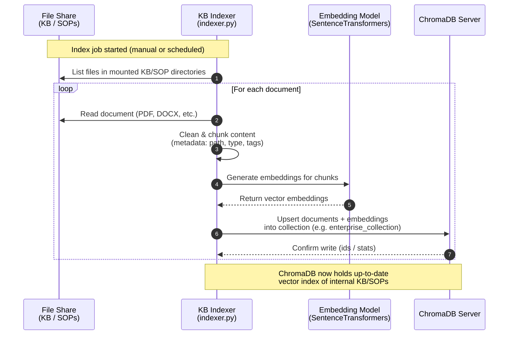
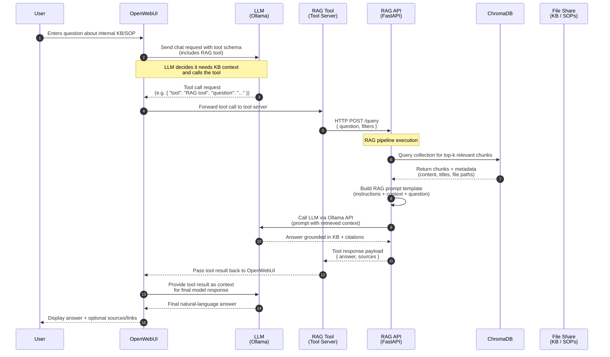

# RAG Sequence Diagrams

This document shows how the AI POC handles:

1. **Indexing** internal knowledge base files into ChromaDB.
2. **Serving RAG queries** from OpenWebUI through the RAG API and ChromaDB into the LLM.

---

## High-Level Summary

- **ETL Pipeline**
    SMB File Shares -> KB Indexer -> Embeddings -> ChromaDB (collection).
- **Query/Response**
    User -> OpenWebUI -> LLM -> External Server Tool -> RAG API -> ChromaDB -> Ollama -> Answer back to User.

This keeps all KB/SOP data internal while still giving the model rich, contextual access to enterprise knowledge through RAG.

---

## 1. Indexing Flow (Enterprise Documents → KB Indexer → ChromaDB)

This flow runs out-of-band via the `kb-indexer` container. It crawls internal SMB shares, chunks documents, and pushes embeddings into ChromaDB.

**Key points:**

- **File Share:** Internal SMB mounts
- **KB Indexer:** Python script/container that:
    - Reads files, normalizes text.
    - Chunks content and attaches metadata (path, doc type, version, date-time).
    - Calls the embedding model and upserts into **ChromaDB**.
- **ChromaDB:** Central vector store serving the *enterprise_collection*.

---

## 2. Query Flow (OpenWebUI → RAG API → ChromaDB → LLM)

This flow shows what happens when a user asks a question in OpenWebUI and the model uses the External Server tool (backed by the RAG API).

**Key points**

- **User -> OpenWebUI**
    The user just chats normally. OpenWebUI sends the prompt to the LLM with the External Server tool available.
- **LLM -> Tool Call**
    The model decides it needs organizational knowledge and triggers the External Server tool, which calls the **RAG API**.
- **RAG API**
    - Accepts the question
    - Queries **ChromaDB** for the most relevant chunks.
    - Constructs a RAG prompt (system instructions + retrieved chunks + user question).
    - Calls **Ollama** to generate an answer grounded in the Collection.
    - Returns both the **answer** and **sources** (file paths / titles /snippet IDs).
- **OpenWebUI Final Answer**
    The tool response is injected back into the LLM's context so it can:
    - Explain the answer in natural language.
    - Surface citations back to the orginal documents on the file share.
